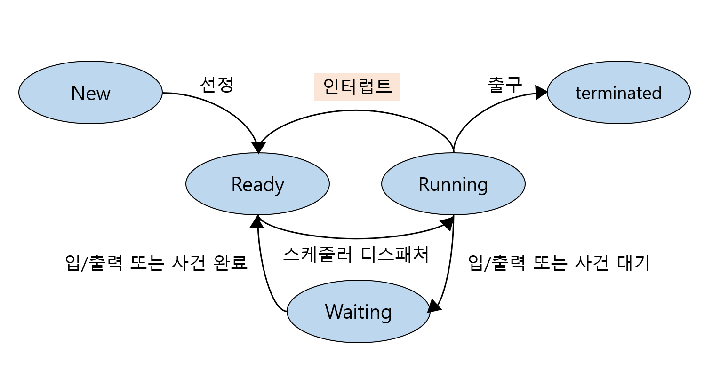

# 운영체제 - 프로세스 

## 목차
- [프로세스란?](#프로세스란?)
    - [프로세스의 능동성](#프로세스의-능동성)
- [프로세스 구성](#프로세스의-구성)
    - [프로세스의 주소공간](#프로세스의-주소공간)
    - [프로세스 제어블록(PCB)](#프로세스-제어블록)
- [프로세스 상태](#프로세스-상태)
- [스레드](#스레드)
- [프로세스 스케줄링](#)
- [프로세스 생성](#)
- [멀티 프로세스](#)

## 프로세스란?
운영체제를 논의할 때 한 가지 주안점은 'CPU 활동들을 어떻게 부를것인가' 입니다.  
일괄처리 시스템은 잡(job)을 실행하는 반면 시분할시스템은 태스크(task)를 가지고 있습니다. 싱글태스킹, 멀티태스킹 지원 임베디드 등에서 운영체제는 '메모리 관리' 같은 운영체제 내부 활동을 지원할 필요가 있는데 여러가지 면에서 이 활동들은 유사하므로 이들을 모두 **'프로세스'**라고 부릅니다.  
더 단순하게 설명하자면, 프로세스는 실행중인 프로그램을 가리키는 말이며 실행중인 '상황'을 저장하고 관리하는 역할을 합니다. 프로세스는 실행될 때 가상 메모리 공간을 할당 받습니다. 프로세스는 실행되는 과정에서 많은 프로세스를 생성하는 것이 보통입니다. 부모-자식 프로세스 간에도 **독립적인 가상 메모리 공간**을 할당받습니다.

### 프로세스의 능동성
프로그램은 디스크에 저장된 파일과 같은 수동적인 존재인 반면,  
프로세스는 다음 실행할 명령어를 지정하는 프로그램카운터(PC)같은 자원 집합을 가진 **능동적인 존재** 입니다.

 ## 프로세스 구성
 ### 프로세스의 주소공간
각 프로세스는 메모리 상에 가상주소 공간을 갖습니다. (이것을 쉽게 '메모리에는 각 프로세스가 존재한다'고 말합니다)
'프로세스의 주소공간'은 메모리에 존재하는 프로세스의 구조입니다.  
프로세스 주소공간의 데이터는 아래에서 부터 쌓입니다. 코드/ 데이터(전역변수)/ 힙(동적할당)/ 스택(임시저장)

- 프로세스의 주소공간
    - 스택(stack): 함수의 매개변수, 복귀주소, 로컬 변수와 같은 임시적인 자료를 가진다. 부족하면 할당받는다.
    - 힙(heap): 프로세스 실행 중 동적으로 할당받는 메모리 이다.
    - 데이터(data): 전역변수를 수록한다. '프로그램'이 종료될때 까지 유지해야 하는 데이터를 주로 저장하는 공간이다.
    - 텍스트(code): 코드를 저장한다.
    
 ### 프로세스 제어블록
각 프로세스는 운영체제에서 프로세스 제어 블록(PCB)에 의해 표현됩니다.  
프로세스 제어블록은 특정 프로세스와 연관된 정보를 저장합니다.
- 프로세스 상태: 새로운(new), 준비완료(ready), 실행(running), 대기(waiting), 또는 종료(terminated)
- 프로그램 카운터: 이 프로세스가 다음에 실행할 명령어의 주소가 저장되어 있습니다.
- CPU 레지스터들: 누산기, 인덱스, 스택 등의 레지스터들과 상태코드 정보를 저장합니다. (컴퓨터마다 수, 종류 다양)
    - 이 상태정보는 프로세스가 계속 올바르게 실행되도록 하기 위해 인터럽트 발생 시 저장되어야 한다.
- CPU-스케줄링 정보: 프로세스 우선순위, 스케줄링에 대한 정보를 저장합니다.
- 메모리 관리 정보: 기준(base)레지스터, 한계(limit)레지스터의 값을 저장합니다. os 메모리 시스템에 따라 페이지 테이블,세그먼트 테이블 같은 정보를 저장합니다.
- 회계 정보: cpu 관련 정보
- 입출력 상태 정보: 이 프로세스에게 할당된 입출력 장치들과 열린파일 목록을 저장합니다.

## 프로세스 상태
프로세스는 실행되면서 상태가 변합니다. 프로세스의 상태를 결정하는 요인은 그 프로세스의 현재 활동입니다.  
프로세스는 다음 상태 중 하나를 갖습니다.

- 새로운(new): 새로운 프로세스가 생성중이다.
- 실행(running): 명령어들이 실행되고 있다.
- 대기(waiting): 프로세스가 어떤 사건(i/o완료 혹은 signal 수신))이 일어나길 기다리고 있다. 
- 준비완료(ready): 프로세스가 처리기(processor)에 할당되기를 기다리고 있다.
- 종료(terminated): 프로세스의 실행이 종료되었다.
    
이들 이름은 운영체제에 따라 달라지나 이들이 나타내는 상태들은 모든 시스템에서 찾아 볼 수 있습니다.  
어느 한 순간에 한 처리기에서 오직 하나의 프로세스만 실행됨을 인식하는 것은 중요합니다.  
아래는 프로세스의 상태에 해당하는 상태도 입니다.

## 스레드
지금까지 설명한 프로세스의 모델은 단일 스레드를 실행하는 프로그램임을 암시했습니다.  
유저는 동일 프로세스 내에서 문자를 입력하며 철자 검사기를 수행할 수 없습니다. 그러나 현대 대부분 운영체제는 프로세스의 개념을 확장하여 하나의 프로세스가 다수의 스레드를 가질 수 있도록 허용합니다. 이러한 특성은 다중 처리기 시스템에서 장점이 빛을 발합니다. 스레드를 병렬로 실행할 수 있게 되는데 스레드를 지원하는 시스템에서는 PCB에 각 스레드의 정보를 저장할 수 있도록 확장됩니다. 

---
이해에 도움이 되는 참조
- 운영체제 9th edition

