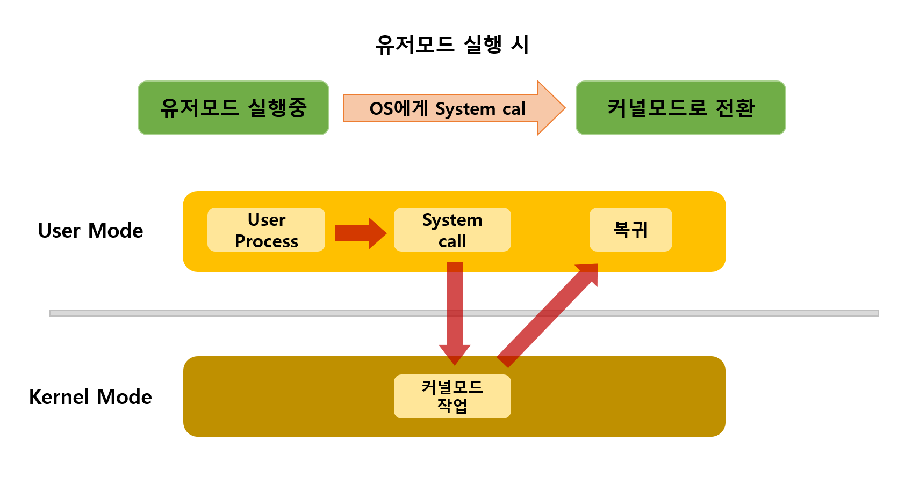
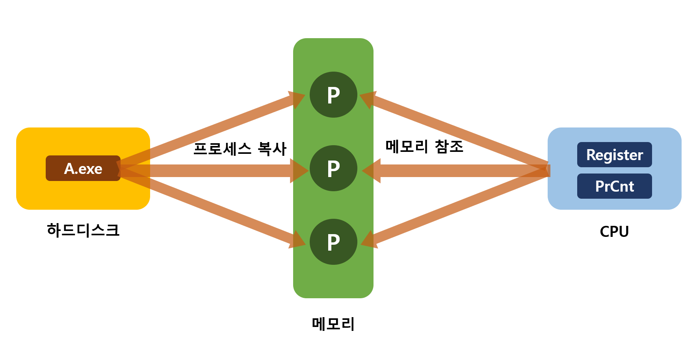

# 운영체제 (OS)
> 전공서적과 학부 수업 내용을 토대로 작성된 글입니다.   본 글에서는 잡과 프로세스를 호환성있게 사용했습니다.

## 운영체제 역할 
 운영체제는 컴퓨터 시스템의 자원을 관리한다.  
- 자원관리 대상: 시스템이 갖는 CPU시간/ 메모리 공간/ 파일저장 공간/ 입출력 장치 동작 
- 관점에 따른 운영체제의 역할
    - 유저 관점: 유저가 수행하는 작업을 최대화 한다. 즉, 사용의 용이성에 중점을 둔다.
    - 시스템 관점: 여러 자원(CPU, 메모리 공간, 파일 저장, 입출력)을 동작시키고 자원을 할당해 효율적으로 관리하는 총체적 제어 프로그램이다. 

## 운영체제 동작 모드 (커널모드 vs 유저모드)
- 운영체제의 동작은 커널모드 vs 유저모드 로 구분된다.
- 각 커널모드는 os동작 목적으로 실행되는 작업, 유저모드는 사용자 목적으로 실행되는 작업을 수행한다.
- 구분 이유
    - 운영체제에서 커널은 핵심 기능을 하기때문에 사용자의 커널자원 접근을 제한해야 한다.

- 프로세스는 유저모드와 커널모드의 전환을 계속 반복하며 작업을 수행한다.
- 유저모드에서 커널모드로 전환시 os에게 system call 신호를 보낸다. 

## 컴퓨터 시스템 구성
- 부트스트랩 프로그램
    - 프로그램은 ROM에 저장되어 있다.
    - 컴퓨터 구동시 수행하는 초기 프로그램. 시스템 모든면을 초기화 시킨다.
    - 디스크에서 운영체제 커널을 찾아 메모리에 적재한다.
- ROM/ EEPROM: 펌웨어에 속한다. 읽기전용 메모리(Read-Only) 이다.c
- 인터럽트(interrupt): 하드웨어나 소프트웨어에서 처리할 일이 생겨서 cpu에게 처리를 요청하는 경우 발생한다.

<!-- ### 운영체제 구조 -->

## 운영체제 관련용어 정리
> 프로세스를 '처리한다 , '수행한다' 가 동일한 의미로 쓰여진 글입니다.

- 인터럽트(Interrupt): 하드웨어나 소프트웨어에서 처리할 일이 생겨서 cpu에게 처리를 요청하는 경우 발생한다.
- 시분할(Time-sharing): 프로세스를 한번에 처리하는게 아니라 여러 프로세스를 조금씩 번갈며 처리하는 방식이다. 
    - 처리하는 수행 작업을 시간적으로 나누어 프로세스에 할당한다. 
    - 빠른 처리속도 덕분에 여러개의 작업이 동시에 처리되는 것 처럼 보이나 처리기가 각 작업에 일정량 시간을 배정하여 순서대로 처리한다.
- 멀티태스팅: task가 하나의 프로세서에게 운영체제 스케줄링에 따라 조금씩 번갈아가면서 수행되는 동작이다.   
    - 멀티태스킹의 스케줄링 방식은 멀티프로그래밍방식(Multi-programming)/시분할(time-sharing)/실시간시스템방식(real-time) 이다.
- 프로그램 카운터: 다음 실행할 프로세스에 관한 정보
- 프로세스 제어 블록 (Process Control Block): 특정 프로세스에 관련된 여러 정보가 저장된 블록
    - 프로세스 상태/프로그램 카운터/CPU 레지스터/CPU-스케줄링정보/메모리관리정보/회계정보/입출력상태정보
- 문맥교환(Context-switching): 인터럽트가 오면 cpu는 하던 작업을 중단하고 다른 프로세스로 교환한다. 문맥교환이 진행될 동안 시스템이 아무런 유용한 일을 하지 못해 오버헤드가 발생한다.
    - overhead: 낭비된 시간. 
    - 위키백과: 오버헤드는 어떤 처리를 하기 위해 추가적으로 필요한 처리 시간, 메모리를 말한다.
- 멀티 스레드: 하나의 프로세스가 작업 여러개를 각각 스레드를 이용해 동시에 처리하는 것
- 멀티 프로세스: 프로세스가 복사되어 같은 코드를 공유한다.
- 멀티 스레드 vs 멀티 프로세스 
    - 공통점: 둘다 동시에 두가지 이상의 루틴을 실행하는 역할을 한다.
    - 멀티스레드는 스택외의 공간들을 공유하므로 효율적. 
    - 멀티프로세스는 부모와 자식 프로세스 사이에도 각자 자신만의 독립적 메모리 영역을 갖는다.
    - context Switching 시에도 시간이 멀티스레드보다 적게든다? 멀티프로세스의 특징인가?
- 커널 스레드: 가장 가벼운 커널 스케줄링 단위이다. 프로세스가 system call을 호출시 생성되어 커널영역에서 스레드 연산을 수행한다.
- 사용자 스레드: 유저모드에서 스레드 연산을 수행하는 역할이다. 스레드 라이브러리에 의해 생성되었으며 커널스레드와 독립적이다. 
- 스레드 취소 2가지
    - 비동기식(Asynchronous): 한 스레드가 자식 스레드를 강제종료 한다.
    - 지연취소(Deffered cancellation): 대상 스레드가 자신이 강제종료 되어야 할지 주기적으로 여부를 점검한다.
- 처리기(processor): 하나의 처리기당 하나의 작업을 기본으로 한다. 처리기 수만큼 작업 처리가 가능하다.
- 암델의 법칙(Amdehl)
    - 처리기가 많을수록 처리가 빠를 것 같지만 반드시 그렇지도 않다는 것을 증명한 법칙
<!-- - 단일처리기(single-p) vs 다중처리기(multi-p) 비교 표만들기 -->
- 스레드풀(Thread pool):  미리 스레드를 할당해 놓는 기법이다. 
    - 작업큐에 작업이 들어오면 스레드가 하나씩 처리하며 수행이 끝난 스레드는 큐에 가서 task를 또 처리한다. 
    - 매 요청마다 thread를 생성하는 것보다 **메모리 공간**과 **cpu 시간**에 효율이 좋다.
- 스레드의 저장소 3가지
    - 스택(stack)
    - 스레드 국지저장소(Thread local storage)
    - 전역변수(local 반대가 뭐더라)
- 스레드 라이브러리
    - 다대일: UT 여러대와 KT 한대가 연결된다.
    - 일대일: UT 한대와 KT 한대가 연결된다. 병렬성은 좋으나 커널 생성시 오버헤드가 크다.
    - 다대다: UT 여러대와 그보다 좀 적은 KT 여러대가 연결되는 방식

- 암묵적 스레드(Implicit Thread)
    - 스레드의 수가 늘어나면 직접 조작하고 활용하는게 어려워 생성과 관리책임을 컴파일과 실행시간 라이브러리에게 넘겨주는 것
    - Thread-pool
- cpu-burst: burst-time 이라고도 한다. cpu가 일을 수행하는 시간
- io-burst: 입력이 들어오고 끝날때까지 block 걸리는 시간
- dispatcher: 스케줄러가 선택한 프로세스를 cpu에게 할당해주는 모듈이다. 정확히 cpu 제어권을 프로세스에게 넘겨준다.
    - 문맥교환시 dispatcher가 관여한다.
    - 사용자 모드로 전환해준다. 
    - 사용자 프로그램 재시작 위해 해당 주소로 이동한다.
- dispatch Latency(사건지연): 프로세스가 중단되고 다른 프로세스를 수행하기까지 걸리는 시간
- convoy effect: 긴 시간의 프로세스가 짧은 시간 프로세스보다 앞에 있는 상황
- 선점형(preemptive): 실행중인 프로세스를 중단시킬 수 있다.
- 비선점(preemptive): 실행중인 프로세스를 중단 할 수 없다.
- waiting-time: 프로세스가 레디큐에서 대기한 시간의 합 
- Starvation(무한봉쇄, 기아상태): 우선순위가 낮은 프로세스는 계속 뒤로 밀려나 봉쇄상태에 빠지는 상황. 
    - 우선순위가 낮은 프로세스들은 cpu를 무한대기 한다.
    - 해결방안=> Aging: 시간이 어느정도 지나면 우선순위를 올려준다.
- Time-Quantum(시간 할당량): 할당되는 처리시간이다. 주어진 퀀텀동안 프로세스를 수행, 처리한다. 

## 프로세스 처리 방법
- 선입선출(First-Come First-Serve)
    - 요청 먼저 들어온 순서대로 p를 처리하는 방법.
    - 비선점(non-preemptive). 프로세스 실행중에 다른 프로세스가 중간에 끼어들지 못한다. 
    - 비선점
- 최단작업 우선처리(Shortest-Job First)
    - 짧은 burst time의 p부터 처리하는 스케줄링.
    - 선점형, 비선점 둘다 존재한다.
    - 장기스케줄링에 효율적이다. 
        - 더 좋은 대안은 최소잔여시간우선(Shortest-Remaining First)
- 우선순위 스케줄링(Priority-Scheduling)
    - 여러가지 기준으로 우선순위를 정하여 스케줄링 하는 방법.
    - 보통 숫자가 낮을수록 우선순위가 높다.
    - Starvation 위험이 있다.
    - 비선점형
- RR (Round Robin)
    - 시분할 시스템에 적용하기 위해 설계된 스케줄링
    - 원형큐에 p가 저장되며 각 p에게 일정한 time-Quantum(시간할당량)을 주어 프로세스를 처리한다.
    - bust-time < Quantum 이면 퀀텀시간이 끝날때 까지 기다린다. 즉 프로세스 처리가 일찍 끝나면 대기한다는 말이다.
    - bust-time > Quantum 이면 처리 다 못하고 다음 프로세스로 차례가 넘어가며 다시 순서가 올때까지 기다려야 한다. 즉 프로세스가 늦게끝나면 다음 p로 넘어간다는 말이다.
    - 선점형
- 다단계 큐(Multi-level Queue)
    - 큐 자체가 우선순위를 갖고있으며 큐와 큐 사이의 스케줄링을 수행한다.
    - 큐의 요소들은 각자의 큐를 벗어나지 않는다.
    - 기본적으로 큐는 foreground(입출력 필요함)와 background(입출력 불필요)로 구분되며 각자의 스케줄링 방식을 갖는다.
        - 보통 foreground가 우선순위가 높으며 f는 주로 RR, b는 주로 FCFS 스케줄링을 한다.
    - 선점형
    - 단점: 우선순위가 낮은 큐는 starvation 위험이 있다. 큐 이동이 안되서 비효율적이다. 대안=> 다단계 피드백큐
- 다단계 피드백 큐
    - 프로세스가 큐 사이를 이동할 수 있다. 

### 프로그램 VS 프로세스

- 프로그램: 하드디스크에 저장되어 수동적으로 실행되는 .exe 실행파일
- 프로세스: 실행중인 프로그램. 실행중인 상황을 저장하고 관리한다. 능동적으로 존재하며 실행될 때 코드, 데이터 공간 등 그리고 메모리를 할당받는다. (메모리에 p의 자리가 생긴다는 뜻)
- 연관동작 과정: 하드디스크의 프로그램 실행이 메모리에 복사(로딩)되면 CPU에서 메모리를 참조해 프로세스를 실행한다. 프로그램을 실행하기 위해 메모리를 할당받은 프로세스들은 동일한 프로그램에 연관될 수 있으나 별도의 실행이다.

---
이해에 도움이 되는 참조
- 운영체제 9th edition
- [overhead](https://velog.io/@adam2/%EC%9D%B8%ED%84%B0%EB%9F%BD%ED%8A%B8)
- [overhead](https://whatisthenext.tistory.com/147)
- [context switch](https://jeong-pro.tistory.com/93)
- [커널스레드 유저스레드](https://www.crocus.co.kr/1255)